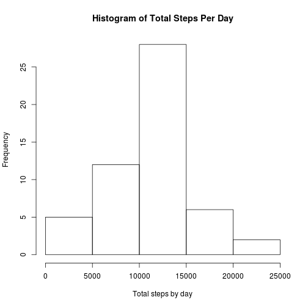
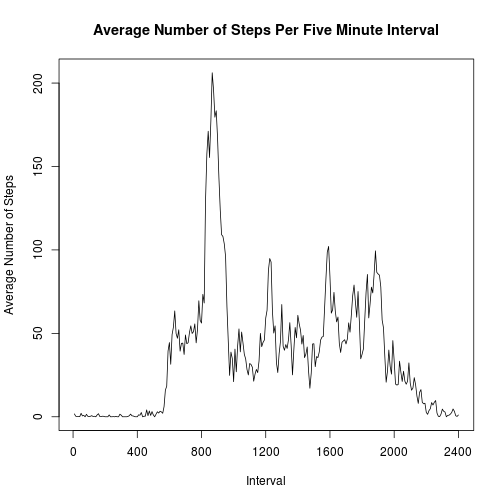
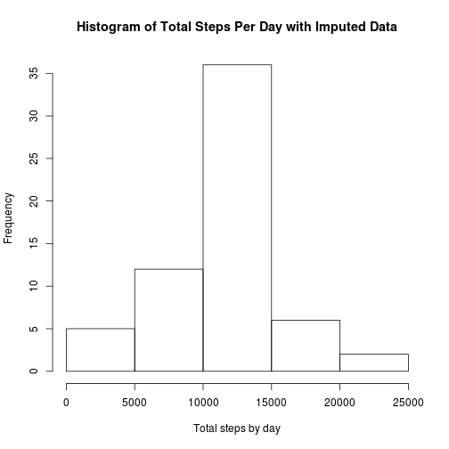
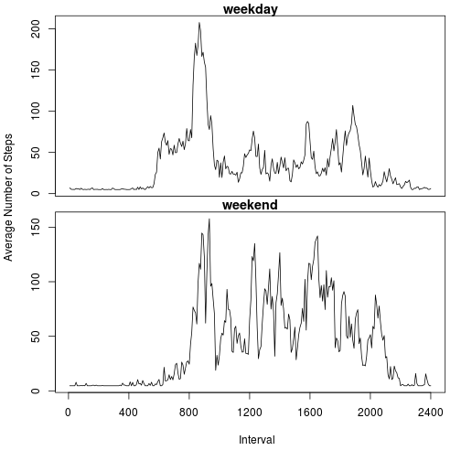

Week 2 Peer Assignment for Reproducible Research
================================================
  
## Introduction

This assignment explores data collected from a personal activity monitoring
device. The device collected data at five minute intervals throughout the day
for a two month period and includes the number of steps taken in those five
minute  intervals.
  
  
### Load and preprocess the data


```r
activity <- read.csv('activity.csv')
activity$date <- as.Date(activity$date)
activity$steps <- as.numeric(as.character(activity$steps))
activity$interval <- as.numeric(as.character(activity$interval))

obs <- nrow(activity)
completeObs <- nrow(na.omit(activity))
missingObs <- obs - completeObs
```

There are 17568 observations. 2304 rows are missing observations.
  
### Histogram of the total number of steps taken each day


```r
total_steps_by_date <- aggregate(activity$steps, by=list(activity$date), FUN=sum)
hist(total_steps_by_date$x, main="Histogram of Total Steps Per Day", xlab="Total steps by day")
```


  
### Calculate the mean and median total number of steps taken per day

For this calculation, we'll use the summary function which also includes
other information such a min, max, quartiles, and the number of NAs.


```r
summary(total_steps_by_date$x)
```

```
##    Min. 1st Qu.  Median    Mean 3rd Qu.    Max.    NA's 
##      41    8841   10760   10770   13290   21190       8
```

### Show the average number of steps per five minute interval for all days


```r
by_interval <- split(activity, activity$interval)
avg_by_interval <- sapply(by_interval, function(x) mean(x$steps, na.rm=TRUE))
plot(avg_by_interval, type="l",
     xlab="Interval",
     ylab="Average Number of Steps",
     main="Average Number of Steps Per Five Minute Interval",
     xaxt = "n")
xtic <- seq(0, length(avg_by_interval), 48)
xlabel <- seq(0, 2400, 400)
axis(1, at=xtic, labels=xlabel)
```



The five minute interval which contains the maximum average number of steps
occurs at interval 835.

### Filling in missing values

Of the 17568 observations, 2304 rows are missing values. We will impute
missing values by using the Hmisc package and using the step value mean as the
imputation function. Since we are talking about steps, the imputed value will be
rounded.


```r
library(Hmisc)
```

```
## Loading required package: lattice
```

```
## Loading required package: survival
```

```
## Loading required package: Formula
```

```
## Loading required package: ggplot2
```

```
## 
## Attaching package: 'Hmisc'
```

```
## The following objects are masked from 'package:base':
## 
##     format.pval, round.POSIXt, trunc.POSIXt, units
```

```r
activity_imputed_mean <- activity
activity_imputed_mean$steps <- round(with(activity_imputed_mean,
    impute(activity_imputed_mean$steps, mean)))
total_steps_by_date_imputed <- aggregate(activity_imputed_mean$steps,
    by=list(activity_imputed_mean$date), FUN=sum)
hist(total_steps_by_date_imputed$x,
     main="Histogram of Total Steps Per Day with Imputed Data",
     xlab="Total steps by day")
```



How do the means and medians compare between the original data and the imputed data?


```r
summary(total_steps_by_date$x)
```

```
##    Min. 1st Qu.  Median    Mean 3rd Qu.    Max.    NA's 
##      41    8841   10760   10770   13290   21190       8
```

```r
summary(total_steps_by_date_imputed$x)
```

```
##    Min. 1st Qu.  Median    Mean 3rd Qu.    Max. 
##      41    9819   10660   10750   12810   21190
```

As you can see, the mean and median shifted lightly, but it is not appreciable.
The shift in the mean is caused by rounding the steps to an integer number.


### Comparison of activity patterns between weekdays and weekends

In order to compare activity between weekdays and weekends, we will create a new
factor called "day" and plot the average number of steps for weekdays separately
from weekends. The activity comparison will be made using the imputed data.


```r
activity_imputed_mean$day <- weekdays(activity_imputed_mean$date)
activity_imputed_mean$day <- apply(activity_imputed_mean['day'], 1,
    function(x) { if ((x=="Saturday") | (x=="Sunday")) "weekend" else "weekday" })

activity_imputed_mean_weekday <- data.frame(split(activity_imputed_mean,
    activity_imputed_mean$day)['weekday'])
activity_imputed_mean_weekend <- data.frame(split(activity_imputed_mean,
    activity_imputed_mean$day)['weekend'])
by_interval_weekday <- split(activity_imputed_mean_weekday,
    activity_imputed_mean_weekday$weekday.interval)
by_interval_weekend <- split(activity_imputed_mean_weekend,
    activity_imputed_mean_weekend$weekend.interval)
avg_by_interval_weekday <- sapply(by_interval_weekday,
    function(x) mean(x$weekday.steps, na.rm=TRUE))
avg_by_interval_weekend <- sapply(by_interval_weekend,
    function(x) mean(x$weekend.steps, na.rm=TRUE))

par(mfrow=c(2,1), oma = c(5,4,0,0) + 0.1, mar = c(0,0,1,1) + 0.1)
plot(avg_by_interval_weekday, type="l", xaxt="n", xlab = "", ylab = "", main="weekday")
plot(avg_by_interval_weekend, type="l", xaxt="n", xlab = "", ylab = "", main="weekend")
axis(1, at=xtic, labels=xlabel)
title(xlab = "Interval",
      ylab = "Average Number of Steps",
      outer = TRUE)
```


